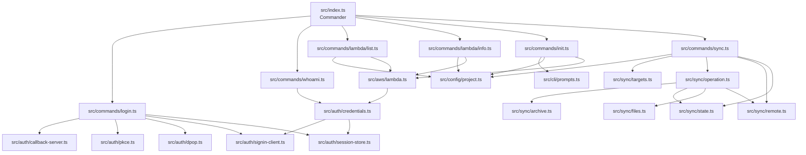

# Architecture

## Komponen

## Struktur source

| Lokasi | Tanggung jawab |
| --- | --- |
| `src/index.ts` | Mendefinisikan command, option, help, version, dan exit status |
| `src/commands/` | Menjalankan satu use case CLI per module |
| `src/commands/lambda/` | Command khusus AWS Lambda |
| `src/commands/sync.ts` | Pemeriksaan batch, konfirmasi gabungan, eksekusi berurutan, dan hasil per function |
| `src/sync/targets.ts` | Resolusi nama eksplisit, semua target, dan filter prefix |
| `src/sync/operation.ts` | Persiapan paket, pemeriksaan konflik, dan penerapan satu function |
| `src/sync/` | ZIP, filesystem, state/lock/backup, dan adapter AWS |
| `src/cli/` | Prompt interaktif berbasis Node readline, validasi input, dan pembatalan |
| `src/auth/` | OAuth callback, PKCE, DPoP, refresh, dan penyimpanan session |
| `src/aws/` | Factory client AWS yang memakai provider credentials lokal |
| `src/config/` | Path dan nilai konfigurasi filesystem |
| `src/config/project.ts` | Schema, pencarian parent, validasi, dan penyimpanan config project |
| `tests/` | Test Node untuk callback, session store, dan output identity |
| `dist/` | Bundle ESM hasil tsup; bukan source of truth |

## Alur command

Setiap action Commander memakai pola yang sama:

1. Parse input CLI.
2. Panggil function command.
3. Tangkap error pada boundary CLI.
4. Tampilkan pesan dan set `process.exitCode = 1`.

Command Lambda membaca project terdekat, lalu memilih region dari option CLI,
project, atau session. Factory client menerima region resource tersebut dan tetap
memakai provider credentials yang terikat pada profile pilihan. `--profile`
menggantikan profile project; tanpa keduanya, gunakan `default`. Refresh auth tetap
memakai region session profile tersebut. `l whoami` menampilkan profile, identitas,
dan region auth.

`l init` menulis config hanya di folder saat ini. Penulisan memakai file sementara
dan publikasi atomik; config baru tidak dapat menimpa file yang sudah ada. Update
memeriksa apakah isi file berubah sejak wizard dibuka sebelum menggantikannya.
Lihat [[Project Configuration]].

Pull/push menyiapkan paket semua target di temp sistem sebelum konfirmasi. Satu lock
project melindungi batch. Eksekusi berurutan memperbarui baseline per function hanya
setelah berhasil disimpan. Kegagalan eksekusi menghentikan target selanjutnya tanpa
membatalkan keberhasilan sebelumnya. Lihat [[Pull and Push#Banyak function sekaligus]].

## Keputusan desain saat ini

> [!info] Session per profile
> `default` memakai `~/.l/session.json`, profile lain memakai
> `~/.l/profiles/<profile>/session.json`. Config project hanya menyimpan nama profile.

> [!info] Deployment kode
> `l push` memperbarui kode `$LATEST`. Konfigurasi dan alias tetap dikelola terpisah.
> Lihat [[Pull and Push]].

> [!info] ESM bundle
> Source memakai ESM dan ekstensi import `.js` sesuai resolusi `NodeNext`. tsup
> menghasilkan satu entry executable dengan shebang untuk Node.js 22.

## Dependency utama

| Package | Peran |
| --- | --- |
| `commander` | Parser dan struktur command CLI |
| `open` | Membuka AWS Sign-In di browser default |
| `@aws-sdk/client-signin` | Penukaran authorization code dan refresh token |
| `@aws-sdk/client-sts` | Verifikasi identitas credentials |
| `@aws-sdk/client-lambda` | Membaca daftar dan konfigurasi Lambda |
| `tsup` | Bundling executable ESM |
| `tsx` | Menjalankan TypeScript saat development/test |
| `yauzl`, `yazl` | Membaca ZIP dan membuat paket deployment |
| `ignore` | Pola gitignore untuk `.lignore` |

Untuk menambah fitur, lanjutkan ke [[Development]]. Untuk detail boundary keamanan,
lihat [[Authentication and Session]].
