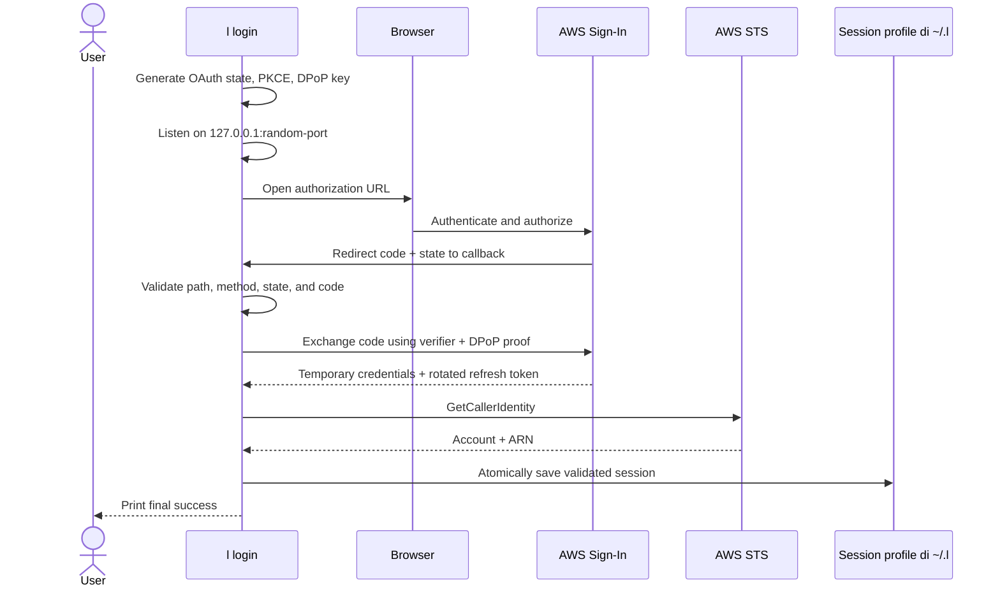
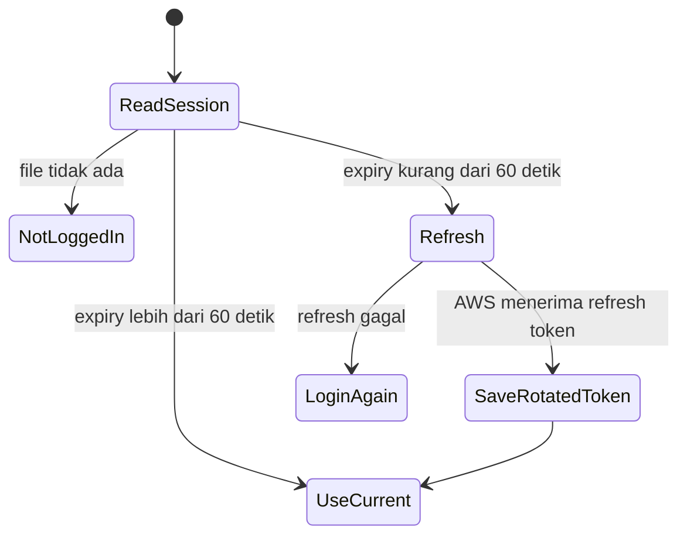

# Authentication and Session

## Login

Browser hanya menyatakan bahwa respons otorisasi sudah diterima. Hasil final tetap
ditampilkan di terminal karena penukaran token, STS, atau penyimpanan masih dapat
gagal setelah callback.

Jika browser tidak dapat dibuka otomatis, CLI tetap menunggu callback. Buka URL
yang ditampilkan di browser pada komputer yang menjalankan CLI. Login melalui SSH
atau container memerlukan callback loopback yang dapat dijangkau dari browser;
membuka URL di komputer lain saja tidak cukup.

Callback server:

- hanya listen pada loopback `127.0.0.1`;
- memakai port acak dari sistem operasi;
- hanya menerima `GET /oauth/callback`;
- menolak state yang berbeda tanpa membatalkan callback yang sah;
- berhenti setelah callback yang sah, error OAuth yang sah, cleanup, atau timeout
  lima menit;
- mengirim `Cache-Control: no-store` pada respons.

## PKCE dan DPoP

PKCE mengikat authorization code ke verifier yang dibuat CLI. Hanya process yang
memiliki verifier dapat menukar code tersebut.

DPoP memakai key EC P-256. Client membuat proof JWT ES256 untuk request ke AWS
Sign-In. Private key yang sama disimpan dalam session agar refresh token tetap dapat
dipakai untuk memperoleh credentials baru.

> [!danger] Data sensitif
> `dpopPrivateKey`, `secretAccessKey`, `sessionToken`, dan `refreshToken` adalah secret.
> Jangan log, commit, kirim, atau salin nilai tersebut ke dokumentasi dan issue.

## Isi session

Session `default` berada di `~/.l/session.json`; profile bernama memakai
`~/.l/profiles/<profile>/session.json`. Isi tiap file memakai schema yang sama.

| Field              | Fungsi                                         |
| ------------------ | ---------------------------------------------- |
| `accessKeyId`      | Bagian credentials AWS sementara               |
| `secretAccessKey`  | Secret credentials sementara                   |
| `sessionToken`     | Token untuk credentials sementara              |
| `expiresAt`        | Waktu expiry dalam ISO 8601                    |
| `refreshToken`     | Memperoleh credentials pengganti               |
| `idToken`          | Identity token dari login awal, jika ada       |
| `dpopPrivateKey`   | Menandatangani proof DPoP saat refresh         |
| `clientId`         | AWS Sign-In client yang dipakai                |
| `region`           | Region login dan client AWS                    |
| `accountId`, `arn` | Identitas hasil verifikasi awal, jika tersedia |

Pada POSIX, directory dipaksa ke mode `0700` dan file baru dibuat dengan mode
`0600`. Penyimpanan memakai file sementara, flush, lalu rename agar session lama
tidak tergantikan oleh JSON yang hanya tertulis sebagian.

Di Windows, lokasi default mengikuti home pengguna, misalnya
`C:\Users\nama\.l\session.json`. Mode POSIX tersebut tidak menggantikan Windows
ACL; akses session mengikuti izin folder user. CLI tidak mengatur ACL khusus.

Saat membaca, struktur dan expiry session divalidasi. Session yang hilang dianggap
belum login; session rusak atau tidak dapat dibaca menghasilkan error yang berbeda.

## Refresh credentials

Sebelum request AWS, credentials provider membandingkan `expiresAt` dengan waktu
saat ini. Refresh dilakukan jika sisa masa berlaku kurang dari 60 detik.

AWS merotasi refresh token. Implementasi selalu menyimpan refresh token terbaru
bersama credentials baru pada profile yang sama. Refresh bersamaan untuk profile
yang sama dalam satu process berbagi satu request; profile lain tetap terpisah.
Jika refresh tidak lagi valid, pesan error menyertakan command login profile yang
tepat, misalnya `l login --profile production`.

## Batasan saat ini

- Belum ada command logout atau revoke.
- Belum ada enkripsi session dengan keychain sistem operasi.
- Tidak mengimpor profile AWS CLI atau membaca `AWS_PROFILE` untuk pemilihan profile.
- Koordinasi refresh antar-process belum tersedia; hindari login/refresh bersamaan
  pada profile yang sama dari beberapa process.
- Region auth berubah melalui login baru; region resource Lambda dapat ditentukan
  lewat [[Project Configuration]] atau option `--region`.

## Auth global dan project lokal

Untuk langkah penggunaan sehari-hari, lihat [[Multi Profile]].

`l init` menyimpan nama project, region resource, nama profile, dan selector Lambda
ke `l.config.json`. Credentials dan key DPoP tetap berada di store global profile.
Prioritas pemilihan adalah `--profile`, config project terdekat, lalu `default`.
Nama profile memakai huruf kecil agar tidak menjadi alias di filesystem yang tidak
membedakan huruf besar/kecil. Path traversal dan symlink pada store profile bernama
ditolak. Profile yang hilang atau rusak tidak dialihkan ke profile lain.

Setiap profile dapat menyimpan session akun berbeda. Login ulang mengganti identitas
semua project yang memakai profile tersebut. Nama profile sendiri tidak mengunci
account; `l whoami` menunjukkan identitas aktual. Pull/push tetap memeriksa ARN
terhadap baseline agar pergantian akun tidak mengubah function pada akun yang salah.

Session lama tidak dipindahkan atau disalin: file lama langsung menjadi `default`.
Project TUI versi awal tetap memakai file default yang sama; profile bernama ini
diimplementasikan pada CLI.

Region resource tidak mengubah region untuk refresh AWS Sign-In. `l whoami`
menampilkan region session auth, yang dapat berbeda dari region project.
