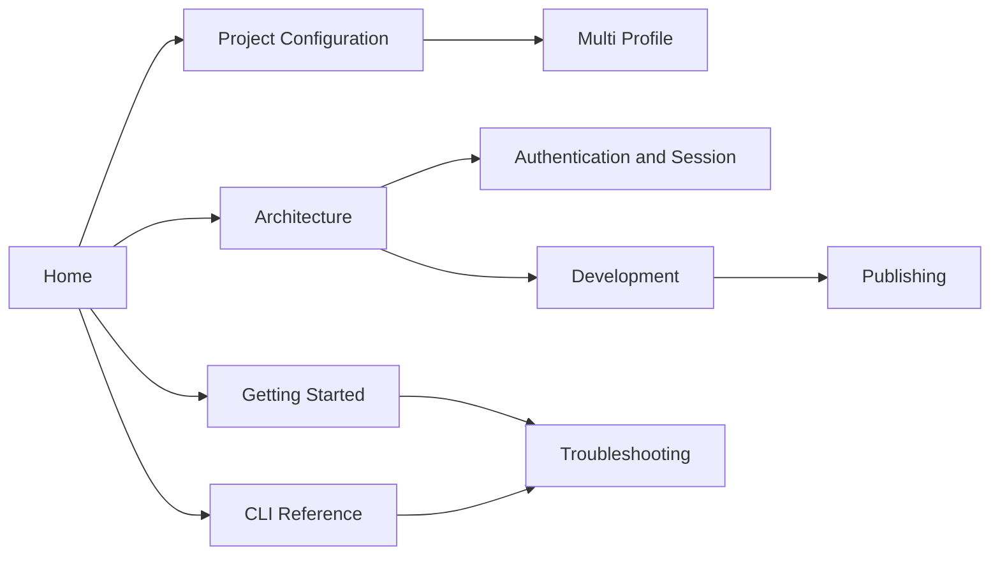

# `l` — AWS Lambda maintenance CLI

`l` adalah CLI kecil untuk login ke AWS lewat browser dan melihat informasi AWS
Lambda dari terminal. Project ditulis dengan TypeScript, Commander, dan AWS SDK v3.

> [!info] Status project
> CLI dapat membaca informasi, mengunduh paket kode, dan memperbarui kode `$LATEST`
> melalui push. Beberapa profile auth dapat disimpan secara global dan dipilih per project.

## Mulai dari sini

- Baru memakai CLI: [[Getting Started]]
- Mencari sintaks command: [[CLI Reference]]
- Mengatur project dengan `l init`: [[Project Configuration]]
- Memisahkan login per account/project: [[Multi Profile]]
- Mengunduh dan mengirim kode: [[Pull and Push]]
- Memahami struktur kode: [[Architecture]]
- Memahami PKCE, DPoP, dan session: [[Authentication and Session]]
- Ingin mengembangkan project: [[Development]]
- Menyiapkan paket npm dan rilis Git: [[Publishing]]
- Menemui error: [[Troubleshooting]]

## Gambaran kemampuan

| Kebutuhan | Command | Dokumentasi |
| --- | --- | --- |
| Login AWS | `l login` | [[Authentication and Session#Login]] |
| Login profile tertentu | `l login --profile production` | [[Multi Profile]] |
| Inisialisasi project | `l init` | [[Project Configuration]] |
| Download kode | `l pull` | [[Pull and Push]] |
| Upload kode | `l push` | [[Pull and Push]] |
| Sinkronisasi banyak function | `l pull api worker`, `l push --all` | [[Pull and Push#Banyak function sekaligus]] |
| Cek identitas | `l whoami` | [[CLI Reference#l whoami]] |
| Daftar Lambda | `l lambda list` | [[CLI Reference#l lambda list]] |
| Detail Lambda | `l lambda info <name>` | [[CLI Reference#l lambda info]] |

## Peta dokumentasi

## Membuka sebagai Obsidian vault

1. Buka Obsidian.
2. Pilih **Open folder as vault**.
3. Pilih folder `docs` di root project.
4. Buka note [[Home]].

Konfigurasi dasar vault pada checkout tersedia di `docs/.obsidian/`. Paket npm hanya
menyertakan note Markdown; Obsidian dapat membuat konfigurasi vault saat dibuka.
Dokumentasi memakai YAML
properties, wikilink, callout, dan diagram Mermaid yang didukung Obsidian.

> [!warning] Jangan simpan secret di vault
> Dokumentasi tidak membutuhkan isi session default maupun profile bernama. Jangan menyalin access key,
> session token, refresh token, atau private key DPoP ke note.
